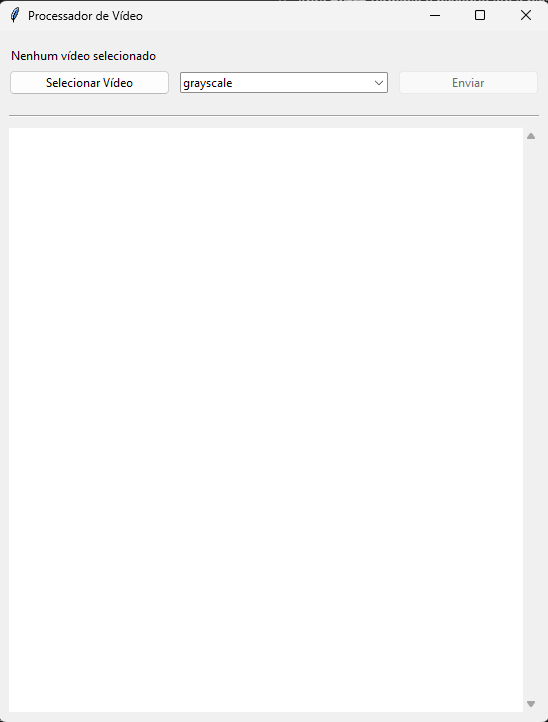
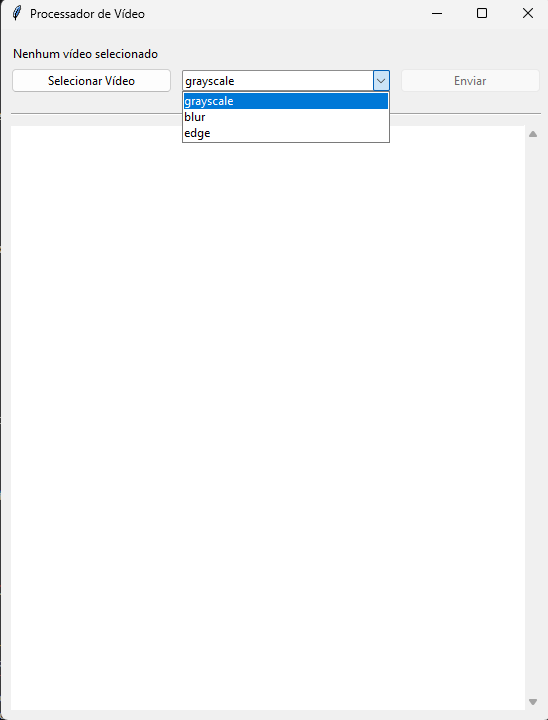
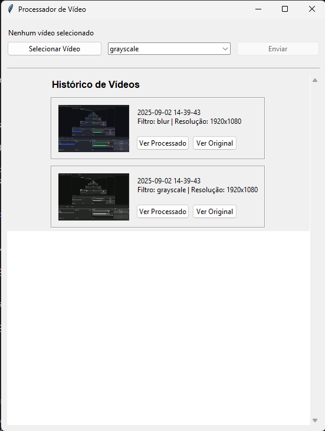
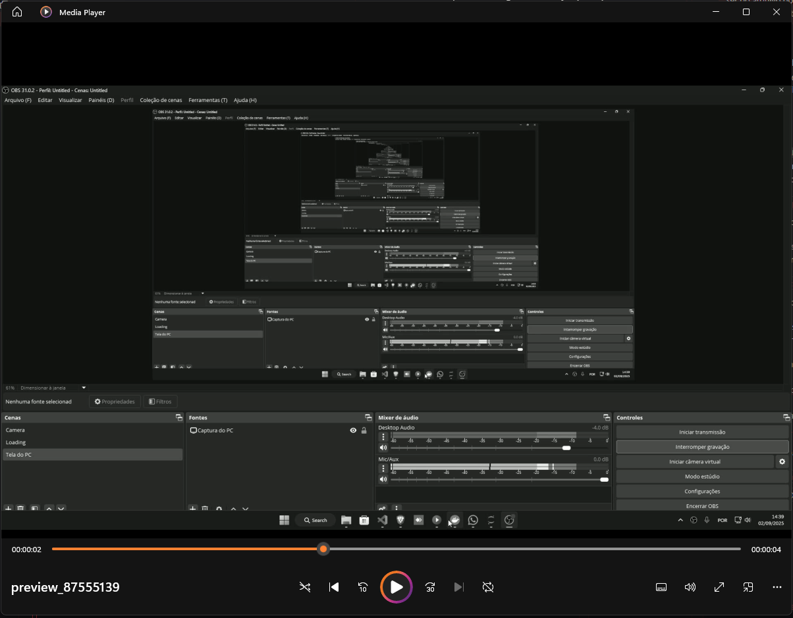

# Processador de Vídeo em Nuvem

Este projeto consiste em um sistema cliente-servidor para processamento de vídeos. O backend, desenvolvido em Flask, recebe vídeos, aplica filtros e os armazena. O frontend, uma aplicação desktop feita com Tkinter, permite que o usuário envie vídeos, escolha filtros e visualize o histórico de processamentos.

## Funcionalidades

- **Upload de Vídeo**: Envio de arquivos de vídeo (MP4, AVI, etc.) para o servidor.
- **Processamento com Filtros**: Aplicação de diversos filtros ao vídeo, como:
  - Grayscale (Escala de Cinza)
  - Blur (Desfoque)
  - Edge (Detecção de Bordas)
  - Brightness (Aumento de Brilho)
  - Sepia
- **Armazenamento**: Os vídeos originais e processados são armazenados no servidor, junto com metadados em um banco de dados SQLite.
- **Cliente Desktop**: Uma interface gráfica para interagir com o servidor, permitindo:
  - Selecionar um vídeo local.
  - Escolher um filtro para aplicar.
  - Enviar o vídeo para processamento.
  - Visualizar o histórico de vídeos processados com thumbnails.
  - Baixar e assistir tanto o vídeo original quanto o processado.
- **Containerização**: O backend é containerizado com Docker para facilitar a implantação e execução.

## Estrutura do Projeto

```
Trabalho_3_SD/
├── backend/
│   ├── app.py             # Aplicação principal do servidor Flask
│   ├── Dockerfile         # Configuração do container Docker
│   ├── requirements.txt   # Dependências Python do backend
│   └── data/              # Banco de dados SQLite
│   └── media/             # Arquivos de vídeo (originais e processados)
├── frontend/
│   ├── client.py          # Aplicação principal do cliente Tkinter
│   └── requirements.txt   # Dependências Python do frontend
└── docker-compose.yml     # Orquestração do serviço de backend
```

## Instruções de Execução

Você pode executar o projeto de duas maneiras: utilizando Docker (recomendado para o backend) ou executando os scripts Python diretamente.

### Pré-requisitos

- [Docker](https://www.docker.com/get-started) e [Docker Compose](https://docs.docker.com/compose/install/)
- [Python 3.8+](https://www.python.org/downloads/)
- `pip` (gerenciador de pacotes do Python)

### Método 1: Executando com Docker (Recomendado)

Este método irá iniciar o servidor backend dentro de um container Docker.

1.  **Clone o repositório** (se ainda não o fez).

2.  **Inicie o serviço de backend:**
    Abra um terminal na raiz do projeto e execute o comando:
    ```bash
    docker-compose up --build -d
    ```
    O servidor estará disponível em `http://localhost:9981` ou `https://api_sd3.kuatech.com.br`.

3.  **Configure o frontend:**
    Navegue até a pasta `frontend` em um novo terminal:
    ```bash
    cd frontend
    ```

4.  **Instale as dependências do cliente:**
    ```bash
    pip install -r requirements.txt
    ```

5.  **Execute o cliente:**
    ```bash
    python client.py
    ```

### Método 2: Executando Localmente (Sem Docker)

Este método executa tanto o backend quanto o frontend diretamente na sua máquina.

1.  **Backend:**
    - Abra um terminal e navegue até a pasta `backend`:
      ```bash
      cd backend
      ```
    - Instale as dependências:
      ```bash
      pip install -r requirements.txt
      ```
    - Inicie o servidor:
      ```bash
      python app.py
      ```

2.  **Frontend:**
    - Abra **outro** terminal e navegue até a pasta `frontend`:
      ```bash
      cd frontend
      ```
    - Instale as dependências:
      ```bash
      pip install -r requirements.txt
      ```
    - Execute o cliente:
      ```bash
      python client.py
      ```

## Prints da Aplicação

Substitua os arquivos de imagem nesta seção pelos prints da sua aplicação em execução.

### Tela Inicial
*A tela principal da aplicação quando é iniciada.*



### Seleção de Vídeo e Filtro
*Mostra um vídeo selecionado e um filtro escolhido, pronto para o envio.*



### Histórico de Vídeos
*Exibe a lista de vídeos que já foram processados.*



### Vídeo Processado
*Demonstração do vídeo após a aplicação do filtro.*


